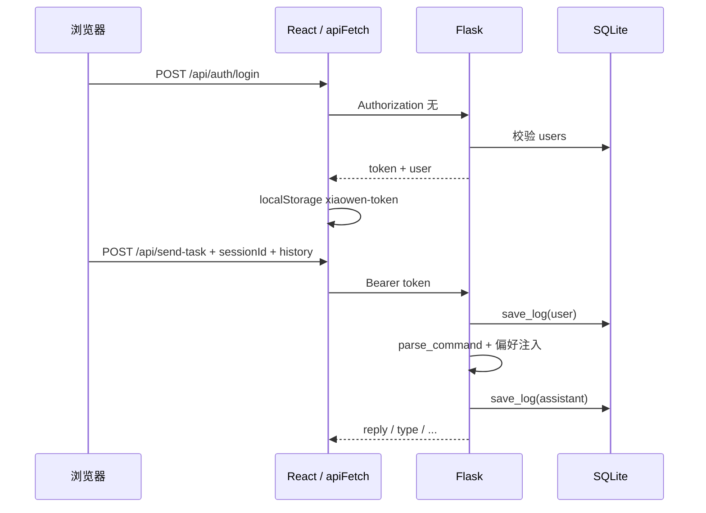

# 小文智能语音助手 - 用户系统模块详细讲解文档

> **实现对照**：`docs/开发计划-用户系统模块.md`（计划） ↔ 本文（实现讲解）
> M1–M5 模块均已在代码中落地。

---

## 项目全景概述

小文是一个运行在个人电脑上的桌面级智能语音助手。用户系统模块解决的核心问题是：**"谁在和小文对话、小文该怎么回应、对话历史如何沉淀"**。技术上，它构建了一套从注册登录（JWT 认证 + 前端闭环）、到身份识别（ProtectedRoute 路由守卫）、再到个性化响应（偏好注入 LLM system prompt）的完整链路，同时用 3D 粒子动画登录页提升第一印象，用 SQLite 日志系统留存用户每一次对话。整个模块约 2000 行代码，覆盖后端 4 个蓝图、前端 6 个核心组件、3 个 Context。下面我将按照三大板块来讲解这个系统。

---

# 板块一：认证与安全体系

> 认证是整个用户系统的"门禁"。这一板块覆盖从密码哈希到前端路由守卫的完整闭环——用户怎么注册、怎么登录、登录态怎么维持、token 过期后怎么优雅登出。

---

## 模块一：JWT 认证系统（后端）

### 1.1 数据库模型层

**文件**：`backend/models/user.py`

#### 1.1.1 get_db() — 获取数据库连接

每次调用返回新连接，调用方负责 `close()`。三个关键设置：

- `row_factory = sqlite3.Row`：让查询结果可以用 `row["username"]` 访问，而不是数字索引
- `PRAGMA journal_mode=WAL`：Write-Ahead Logging，允许多个读操作和一个写操作并发，避免 Flask 多线程下的 `database is locked`
- `PRAGMA foreign_keys=ON`：SQLite 默认不检查外键，必须手动开启

这相当于告诉 SQLite："我们是多线程环境，读写别互相阻塞。"

#### 1.1.2 init_db() — 建表

`CREATE TABLE IF NOT EXISTS` 一次性创建三张表，幂等可重复执行：

| 表名 | 用途 | 核心字段 |
|------|------|----------|
| `users` | 用户账号 | id, username, password, display_name, role, avatar_url, created_at |
| `user_preferences` | 用户偏好 | user_id (FK), pref_key, pref_value, PRIMARY KEY (user_id, pref_key) |
| `user_logs` | 对话日志 | user_id (FK), session_id, role, content, intent, metadata, created_at |

三个索引全部建在 `user_logs` 上——因为它是数据量最大的表，按 user_id 隔离、按 session_id 筛选、按时间排序是最频繁的查询模式。`ON DELETE CASCADE` 确保删除用户时偏好和日志自动清理，不留孤儿数据。

#### 1.1.3 UserModel 类 — 四个静态方法

| 方法 | 功能 | 关键 SQL |
|------|------|----------|
| `get_by_id(user_id)` | 按 ID 查用户 | `SELECT * FROM users WHERE id=?` |
| `get_by_username(username)` | 按用户名查用户 | `SELECT * FROM users WHERE username=?` |
| `create(username, password, display_name)` | 创建新用户 | `INSERT INTO users(...)` 返回 lastrowid |
| `update_profile(user_id, **kwargs)` | 更新用户资料 | `UPDATE users SET ... WHERE id=?` |

选用静态方法而非实例方法——这是典型的 DAO（数据访问对象）模式，不需要实例状态。`update_profile` 用白名单 `{"display_name", "role", "avatar_url"}` 防止越权更新。

#### 1.1.4 save_log() — 日志写入

独立函数而非 `UserModel` 方法。日志写入是高频操作（每轮对话触发两次），放在模块顶层方便 `routes/api.py` 直接调用，不必每次实例化 UserModel。

---

### 1.2 认证路由

**文件**：`backend/routes/auth.py`

#### 1.2.1 注册：`POST /api/auth/register`

流程很直：校验格式 → 查重 → 密码哈希 → 写库 → 签发 JWT → 返回 token+user。

关键决策：**注册即登录**，直接返回 token。桌面应用没有邮箱验证环节，省一步就是一步。

密码哈希用 werkzeug 的 `generate_password_hash`，底层是 `pbkdf2:sha256` 加自动盐值——即使数据库泄露，攻击者也很难还原密码。

JWT 的 identity 存 `str(user_id)` 而非整数，因为 `flask-jwt-extended` 要求 identity 必须可 JSON 序列化。

#### 1.2.2 登录：`POST /api/auth/login`

查用户 → 验证密码 → 签发 JWT。错误信息统一返回"用户名或密码错误"——不区分"用户不存在"和"密码错误"，防止用户枚举攻击。

#### 1.2.3 获取当前用户：`GET /api/auth/me`

`@jwt_required()` 装饰器自动从 Header 提取并验证 token。这是前端"刷新页面恢复登录态"的关键接口——`AuthContext` 初始化时调用它来验证 localStorage 中 token 是否还有效。

---

### 1.3 Flask 应用装配

**文件**：`backend/app.py`

四个蓝图各司其职：

| 蓝图 | 前缀 | 是否需要认证 |
|------|------|-------------|
| `auth_bp` | `/api/auth` | 否（公开） |
| `api_bp` | `/api` | 需 `@jwt_required()` |
| `logs_bp` | `/api/logs` | 需 `@jwt_required()` |
| `pref_bp` | `/api/preferences` | 需 `@jwt_required()` |

Token 24 小时过期——桌面应用在个人电脑上运行，用户不会频繁被踢下线，15 分钟的短过期反而影响体验。`JWT_SECRET_KEY` 从环境变量读取，默认值仅限本地开发。

> **讲解小结**：JWT 认证体系的核心设计取舍是"安全与便利的平衡"——pbkdf2 保证密码安全，24 小时过期保证体验，蓝图分离保证代码可维护。记住三个关键接口：register / login / me。

<!-- ⚡ 讲到这里可以停顿提问：为什么不用 session+cookie 而选 JWT？ -->

---

## 模块二：前端认证闭环

### 2.1 应用入口 — 组件树

**文件**：`xiao-wen-ai/src/main.jsx`

```
StrictMode
  └── BrowserRouter
       └── AuthProvider
            └── AppRouter
                 ├── /login  → LoginPage
                 └── /*      → ProtectedRoute → PreferencesProvider → App
```

组件层级从上到下形成"环境 → 路由 → 认证 → 授权 → 偏好 → 应用"的清晰分层。`AuthProvider` 放在 `BrowserRouter` 内部，使得 `AuthContext` 可以使用 `useNavigate()` 等路由 hooks。

---

### 2.2 AuthContext — 认证状态中枢

**文件**：`xiao-wen-ai/src/contexts/AuthContext.jsx`

三个核心状态：

| 状态 | 类型 | 含义 |
|------|------|------|
| `user` | `object \| null` | 当前登录用户信息 |
| `token` | `string \| null` | JWT token，懒初始化为 `localStorage.getItem('xiaowen-token')` |
| `loading` | `boolean` | 认证状态验证中标志 |

三种状态组合决定了 ProtectedRoute 的表现：

| loading | user | ProtectedRoute 表现 |
|---------|------|---------------------|
| `true` | — | 显示"加载中..." |
| `false` | `null` | `Navigate → /login` |
| `false` | `object` | 正常渲染子组件 |

这里的关键是 `loading` 态——如果没有这个中间态，刷新页面时会在 token 验证成功前闪现登录页，这就是典型的 FOUC（Flash of Unauthenticated Content）问题。

#### Token 验证与过期事件

初始化时 `apiFetch('/api/auth/me')` 验证 token。如果返回 401 → 调用 `logout()` 清除状态。

认证过期用了 DOM 自定义事件解耦：`apiBase.js` 检测到 401 时触发 `xiaowen-auth-expired`，`AuthContext` 监听该事件执行登出。这样做的好处是 `apiBase.js` 作为纯工具模块不需要引用 `AuthContext`，避免了循环依赖。

#### 注册后的引导标记

`markJustRegistered` 把用户 ID 写到 `sessionStorage`。选择 `sessionStorage` 而非 `localStorage` 是因为关闭标签页自动清除——刷新页面不会重复弹引导，但也不会永久残留。

---

### 2.3 ProtectedRoute — 路由守卫

**文件**：`xiao-wen-ai/src/components/ProtectedRoute.jsx`

```jsx
function ProtectedRoute({ children }) {
  const { user, loading } = useAuth()

  if (loading) return <div>加载中...</div>
  if (!user) return <Navigate to="/login" replace />

  return children
}
```

三个分支精确覆盖 loading / 未登录 / 已登录三种状态。`replace` 导航不在浏览器历史栈中留下守卫页面的空白记录。

---

### 2.4 AppRouter — 路由编排

**文件**：`xiao-wen-ai/src/AppRouter.jsx`

两个关键决策：
- 已登录用户访问 `/login` 自动重定向到 `/`，防止看到登录表单
- `PreferencesProvider` 放在 `ProtectedRoute` 内部——只有登录后才加载偏好上下文，避免未登录状态下发起 `/api/preferences` 导致 401 触发登出副作用链

> **讲解小结**：前端认证闭环的核心是"三态设计"——loading / 未登录 / 已登录，一个状态都不能少。token 存储选 `localStorage`、过期通信用 CustomEvent，都是在桌面应用这个具体场景下的务实选择。

---

# 板块二：交互体验层

> 认证是"能不能用"，体验是"好不好用"。这一板块聚焦用户第一眼看到的东西——粒子动画登录页、主界面 Header 操作区、底部活动面板——以及支撑这些体验的工程细节。

---

## 模块三：3D 粒子登录页

**文件**：`xiao-wen-ai/src/components/LoginParticleBg.jsx` 和 `LoginPage.jsx`

### 3.1 双层架构

```
.login-page (全屏容器)
  ├── <LoginParticleBg /> (背景层, z-index:0, pointer-events:none)
  └── .login-card (前景卡片, z-index:1)
```

Canvas 粒子球在卡片下方旋转，设置 `pointer-events: none` 确保不阻挡点击。

### 3.2 粒子球面均匀分布

核心代码只有三行：

```js
const theta = Math.random() * Math.PI * 2          // 经度角 [0, 2π)
const phi = Math.acos(2 * Math.random() - 1)       // 纬度角，球面均匀分布
const radius = 2.5 + Math.random() * 1.0           // 中空球壳半径 2.5~3.5
```

为什么用 `acos(2r-1)` 而不是直接 `Math.random() * PI`？因为球面面积元素是 `sin(φ)`——如果直接线性采样，粒子会在南北两极扎堆，赤道区域稀疏。`acos(2r-1)` 这个变换正好抵消 `sin(φ)` 因子，实现真正的均匀分布。

选"中空球壳"而非实心球，是让中心区域留给登录卡片，粒子环绕在四周，视觉上更有层次感。

### 3.3 颜色与发光效果

四种颜色按权重分配：蓝 `#4A90D9`（35%）、紫 `#7C5CFC`（25%）、青绿 `#00D4AA`（20%）、白 `#FFFFFF`（20%）。白色粒子用双倍大小的点精灵，形成星光点缀。

发光效果的秘密是 `THREE.AdditiveBlending`——叠加混合模式下，每个像素的 RGB 值直接相加，黑色背景上的粒子不会互相遮挡，反而越叠越亮。配合 `depthWrite: false`，所有粒子同时可见，形成完整的发光星场。

### 3.4 动画：自转 + 鼠标视差

粒子球缓慢自转，同时响应鼠标位置做偏移。关键是用 lerp（线性插值）平滑过渡：

```js
targetRotationX = mouseY * 0.3    // 鼠标位置映射为 ±17° 偏移
currentRX += (targetRotationX - currentRX) * 0.05  // 约 0.6 秒到位
```

系数 `0.05` 在 60fps 下提供约 0.6 秒的过渡——既跟手又不突兀。主界面 ambient 模式下转速减半，减少视觉干扰。

### 3.5 性能：两刀切

- `Math.min(devicePixelRatio, 2)`：Retina 屏幕 DPR=3 时渲染像素数从 737 万降到 328 万
- 移动端降级到 200 粒子

### 3.6 资源清理

Three.js 组件的清理不是可选项，是**强制标配**：geometry / material / texture 全部 dispose，renderer dispose，requestAnimationFrame cancel，三个事件监听器 remove。不做完整清理会导致 GPU 显存泄漏、WebGL 上下文泄漏、事件监听器泄漏——多次挂载卸载后浏览器直接崩溃。

> **讲解小结**：3D 粒子的技术亮点不在"做了个粒子球"，而在"怎么做的"——acos 均匀分布、AdditiveBlending 发光、lerp 平滑视差、DPR 限制性能保障。这些细节体现的是工程素养而非单纯炫技。

<!-- ⚡ 讲到这里可以停顿提问：球面均匀分布的数学原理，或者 AdditiveBlending 和 NormalBlending 的区别 -->

---

## Header 控件与退出登录

**文件**：`xiao-wen-ai/src/App.jsx`

Header 右侧两个按钮：偏好设置（齿轮图标）和退出登录（电源图标）。

退出登录的流程：点击 → `logout()` 清除 token + user → `navigate('/login', { replace: true })`。

SVG 图标内联在 JSX 中，通过 `fill="currentColor"` 或 `stroke="currentColor"` 自动适配深浅色主题——切换主题时不需要替换图标文件。

---

## ActivityDock 集成

底部活动区架构：

```
ActivityDock
  ├── 收起/展开按钮
  ├── Tab 切换：log | history
  ├── LogPanel：运行日志 + 虚拟滚动
  └── historyPanel=<ChatHistoryPanel />：云端对话历史
```

ActivityDock 作为可折叠面板，默认收起，展开后占主舞台下方约 30%。"实时运行日志"和"云端对话历史"共享同一块屏幕空间，切换 Tab 即可。

---

## 两套对话历史 —— 概念区分

项目中存在两套"对话历史"，答辩时这是一个容易混淆的点：

| 维度 | 前端多轮上下文 | 云端用户日志 |
|------|----------------|--------------|
| 存储 | `chatHistory` + `localStorage`（`xiaowen_chat_history`） | SQLite `user_logs` 表 |
| 主要组件 | `ChatHistoryView`（主舞台对话气泡） | `ChatHistoryPanel`（底部 ActivityDock） |
| 发给后端 | `POST /api/send-task` 的 `history` 字段，参与 LLM 上下文 | 不直接参与 LLM 上下文 |
| 生命周期 | 可被"再见"等指令清空；刷新从 `localStorage` 恢复 | 按 `user_id` 永久持久化 |

> **一句话区分**：`ChatHistoryPanel` 展示的是已持久化的云端日志，LLM 多轮上下文来自前端 `chatHistory`。两者数据来源不同、互不依赖。

> **讲解小结**：交互体验层的设计原则是"视觉为功能服务"——粒子动画不挡点击、SVG 图标适配主题、双历史概念清晰。答辩时如果被问到"为什么有两套历史"，上表可以直接引用。

---

# 板块三：数据体系 —— API、偏好、日志

> 有了认证和体验，接下来是"数据怎么流"。这一板块覆盖三个子系统：统一 API 层的 token 自动注入、个人偏好从设置面板到 LLM system prompt 的端到端链路、以及对话日志的两阶段写入和分页查询。

---

## 统一 API 层

**文件**：`xiao-wen-ai/src/apiBase.js`

### apiFetch：自动注入 token

```js
export async function apiFetch(path, options = {}) {
  const token = localStorage.getItem('xiaowen-token')
  const headers = {
    ...(options.headers || {}),
    ...(token ? { Authorization: `Bearer ${token}` } : {}),
  }
  const res = await fetch(apiUrl(path), { ...options, headers })

  if (res.status === 401 && !path.includes('/api/auth/')) {
    window.dispatchEvent(new CustomEvent('xiaowen-auth-expired'))
  }
  return res
}
```

这里的关键设计有三点：

1. **全局替换**：项目中有 10+ 处 API 调用，统一用 `apiFetch` 避免某处忘记传 token → 401 → 用户困惑
2. **自动注入**：每个调用点不需要手动从 `localStorage` 读 token 拼 header
3. **401 绕过 `/api/auth/`**：login/register 返回 401 是密码错误，不该触发全局登出

### 环境切换

```
VITE_API_URL > VITE_API_BASE > DEV='' > PROD='http://127.0.0.1:5001'
```

开发环境返回空字符串，走 Vite 代理转发到 Flask 5001；生产构建直接连 `127.0.0.1:5001`。开发者无需手动切换。

---

## sessionId 与全局会话

**文件**：`xiao-wen-ai/src/App.jsx`

```js
const [sessionId] = useState(() => {
  try {
    return crypto.randomUUID()
  } catch {
    return Date.now().toString(36) + Math.random().toString(36).slice(2, 8)
  }
})
```

`useState(() => ...)` 懒初始化 + **无 setter**——解构只取第一个值，`sessionId` 在页面生命周期内不变。`crypto.randomUUID()` 是 W3C 标准方法，Chrome 92+ 原生支持，无需引入 npm 包。降级方案用 36 进制时间戳 + 随机字符串，极老浏览器上也能保证唯一性。

| 层级 | 行为 |
|------|------|
| 前端 | `useState(() => crypto.randomUUID())`，**无 setter**，页面打开期间不变 |
| 请求体 | `POST /api/send-task` 的 `sessionId` 字段 |
| 后端缺省 | 未传时使用 `"default"` |
| 刷新页面 | **新 UUID → 新会话**；旧会话仍在 `/api/logs` 可按 `session_id` 查询 |

---

## 个人偏好系统

### 5.1 后端偏好 API

**文件**：`backend/routes/preferences.py`

六项偏好 + 默认值（`DEFAULT_PREFERENCES` 字典作为白名单基线）：

| 键 | 含义 | 默认值 | 控件类型 |
|-----|------|--------|----------|
| `display_name` | 称呼 | `""` | text |
| `role` | 职业 / 角色 | `""` | text |
| `interests` | 兴趣领域 | `""` | text |
| `language_style` | 回复风格 | `"casual"` | select |
| `response_length` | 回复长度 | `"medium"` | select |
| `tts_voice` | TTS 音色 | `"default"` | select |

写入用 SQLite UPSERT 而非先删后插：

```sql
INSERT INTO user_preferences (user_id, pref_key, pref_value)
VALUES (?, ?, ?)
ON CONFLICT(user_id, pref_key) DO UPDATE SET pref_value = excluded.pref_value
```

这是原子操作，不会被其他并发请求打断。

### 5.2 偏好注入到 LLM

**文件**：`backend/logic/task_parser.py`

偏好以追加片段形式注入 system prompt。每个偏好项独立一行，便于 LLM 逐条遵守：

| 偏好键 | 注入模板 |
|--------|----------|
| `display_name`（非空） | `用户称呼：{value}，请在对话中使用此称呼。` |
| `role`（非空） | `用户职业/角色：{value}，请据此调整回复的专业程度。` |
| `interests`（非空） | `用户兴趣领域：{value}，可在合适时引用。` |
| `language_style` | casual → `回复语气：轻松随意`；formal → `正式专业`；concise → `简洁精炼` |
| `response_length` | short → `简短，1-2句话`；medium → 不额外注入；long → `详细展开` |

空值不注入——减少无效 token 消耗。`tts_voice` 不注入，因为它是纯前端属性。

异常保护用 `try/except` 包裹：偏好注入失败最多是"偏好没生效"，不会导致"小文不回复了"。

### 5.3 前端 SettingsPanel

**文件**：`xiao-wen-ai/src/components/SettingsPanel.jsx`

六个字段，text + select 两类控件。保存后 600ms 延迟自动关闭弹窗——给用户短暂确认"保存成功"的时间。

### 5.4 首次引导逻辑

**文件**：`xiao-wen-ai/src/contexts/PreferencesContext.jsx`

新用户注册后自动弹出 `PreferencesGuide`，引导设置偏好。OR 逻辑确保精准触发：新用户必然触发；老用户若三项文字偏好仍为空，也会再次看到引导；用户手动关闭后不再弹出。

`sessionStorage` 存储注册标记——同标签页关闭自动清除，刷新不丢失也不残留。

> **讲解小结**：偏好系统的核心思想是"用户告诉小文'我是谁'，小文据此调整回复"。技术上从 SettingsPanel 到 LLM system prompt 是完整闭环，UPSERT 保证并发安全，空值不注入节约 token。

---

## 用户日志系统

### 6.1 两阶段写入

**文件**：`backend/routes/api.py`

```
阶段 1（业务前）: save_log(user_id, session_id, "user", task)
                    ↓
              parse_command(...)
                    ↓
阶段 2（业务后）: save_log(user_id, session_id, "assistant", reply, intent_hint)
```

阶段一先于业务逻辑——即使 `parse_command` 中途异常（LLM 超时等），用户的输入已经持久化。阶段二的写入在 `return jsonify` 之前，保证助手回复同步记录。

### 6.2 日志查询

**文件**：`backend/routes/logs.py`

`GET /api/logs` 支持按 `sessionId` 筛选、分页。返回 `{ logs, sessions, total, page, pageSize }`。会话列表独立于分页日志——前端可以同时展示"会话摘要"和"当前日志"，两个数据流互不影响。

所有查询强制 `WHERE user_id = ?`，JWT 保证 user_id 真实性，实现多用户数据隔离。

### 6.3 前端 ChatHistoryPanel

**文件**：`xiao-wen-ai/src/components/ChatHistoryPanel.jsx`

会话筛选 + 分页加载（每页 30 条）+ 每条显示时间（`MM-DD HH:mm`）、角色标签、意图标签、内容预览。切换会话自动重置分页，不会混入其他会话数据。

> **讲解小结**：日志系统的设计原则是"先记再处理"——输入先落库，防止异常丢数据。两阶段写入 + `WHERE user_id` 隔离 + 会话独立列表，构成了完整的数据闭环。

---

## user_logs.metadata 预留字段

`user_logs` 表含 `metadata TEXT DEFAULT '{}'` 字段，当前 `save_log()` 未写入。预留用途：模型名称、请求耗时、Token 用量统计、导出标记。

---

## 偏好 → TTS 端到端链路

```
SettingsPanel 保存 tts_voice
  → PUT /api/preferences { tts_voice: "gentle_female" }
  → refreshPreferences()
  → syncTtsVoicePref() → localStorage VOICE_PREF_KEY
  → xfyunTts.js 朗读时读取
  → POST /api/tts { voice: "female_jiuxu" }
```

`TTS_VOICE_MAP` 中 `steady_male` 回退到 `female`——经典音库男声效果一般，建议启用超拟人男声发音人。

---

## 端到端请求时序

从登录到发指令、写日志的典型链路：



401 时：非 `/api/auth/` 接口由 `apiFetch` 派发 `xiaowen-auth-expired`，`AuthContext` 执行 `logout()`。

> **板块小结**：数据体系三条线——API 层的 token 透传让每个请求都携带身份、偏好系统让 LLM"认识用户"、日志系统让每次对话都被记录。它们共同的基石是 JWT identity 从 token 而非请求体获取。

---

# 附录

## A. API 接口一览表

| 路径 | 方法 | JWT | 说明 |
|------|------|-----|------|
| `/api/auth/register` | POST | 否 | 注册，返回 token（HTTP 201） |
| `/api/auth/login` | POST | 否 | 登录，返回 token（HTTP 200） |
| `/api/auth/me` | GET | 是 | 校验 token、恢复 user 信息 |
| `/api/preferences` | GET | 是 | 读取偏好（含默认值合并） |
| `/api/preferences` | PUT | 是 | 批量更新，返回 `{ status, updated }` |
| `/api/logs` | GET | 是 | 分页日志 + 会话列表 |
| `/api/send-task` | POST | 是 | 主业务入口，写日志 |
| `/api/tts` | POST | 是 | TTS 语音合成 |
| `/api/speech-to-text` | POST | 是 | 讯飞听写（WAV 上传） |
| `/api/translate-selection` | POST | 是 | 选中文本翻译 |
| `/api/analyze-image` | POST | 是 | 图片理解上传 |
| `/api/generate-chart` | POST | 是 | 图表数据上传 |
| `/api/user-apps` | GET/POST/DELETE | 是 | 本机应用白名单 |
| `/api/capabilities` | GET | **否** | 讯飞 ASR、Windows 选 exe 能力探测 |

> `/api/capabilities` 无需 JWT——前端可探测能力；其余业务接口需 `@jwt_required()`。

---

## B. 测试命令与用例

```bash
# 在 backend 目录下执行
python -m unittest tests.test_auth -v
```

| 用例 | 验证点 |
|------|--------|
| `test_register_success` | 201 + token |
| `test_register_duplicate_username` | 409 冲突 |
| `test_login_wrong_password` | 401 未授权 |
| `test_me_requires_token` | 401（无 token） |
| `test_me_with_valid_token` | 200 + user 对象 |

数据库文件：`backend/xiaowen.db`（开发库）；测试用临时库见 `tests/test_auth.py`。

---

## C. 安全与局限

| 主题 | 当前实现 | 说明 |
|------|----------|------|
| Token 存储 | `localStorage` | 同源 XSS 可窃取；桌面本地场景可接受 |
| 刷新 Token | 无 | 24h 过期需重新登录 |
| 注册/登录限流 | 无 | 无防暴力破解机制 |
| 密码策略 | ≥6 位 | 无复杂度要求；werkzeug 默认 pbkdf2:sha256 |
| 生产密钥 | `JWT_SECRET_KEY` 环境变量 | 必须覆盖默认值 |
| 部分 API 未走 `apiFetch` | `xfyunTts.js` 等 | 自行带 token 或无需认证 |
| 多用户隔离 | `WHERE user_id = ?` | identity 来自 JWT 而非请求体 |

---

## D. 关键技术决策汇总

| 决策 | 理由 |
|------|------|
| SQLite + `PRAGMA WAL` | 开发阶段零配置；WAL 模式支持 Flask 单进程多线程并发读写 |
| `Flask-JWT-Extended` | Flask 生态标准 JWT 方案；装饰器语法简洁 (`@jwt_required()`) |
| JWT identity 使用字符串 | `flask-jwt-extended` 内部要求 identity 可 JSON 序列化 |
| 注册即登录（注册后直接返回 token） | 减少用户操作步骤——桌面应用无需邮箱验证流程 |
| Token 24 小时过期 | 桌面应用场景（个人电脑），平衡安全与便利 |
| `localStorage` 存 token | 前端持久化方案；刷新页面不丢失登录态 |
| `xiaowen-auth-expired` 自定义事件 | `apiBase.js` 与 `AuthContext` 解耦；避免循环依赖 |
| Three.js `setPixelRatio ≤ 2` | 4K / Retina 屏幕性能保障 |
| `AdditiveBlending` | 粒子发光效果的核心——叠加混合 + 黑色背景 = 星光粒子 |
| lerp 系数 `0.05` 平滑视差 | 避免鼠标移动时粒子突兀跳变 |
| UPSERT 偏好写入 | 原子操作（`ON CONFLICT DO UPDATE`）；避免并发覆盖 |
| ProtectedRoute 三态（loading / 未登录 / 已登录） | `loading` 态避免 token 验证期间闪现登录页（FOUC 问题） |
| `PreferencesProvider` 放在 `ProtectedRoute` 内部 | 避免未认证状态发起偏好 API → 401 → 触发全局登出事件链 |
| `sessionId` 使用 `useState` 懒初始化 + 无 setter | 页面生命周期内唯一标识；生成后不可变 |
| SVGs 内联而非外链 | 无额外网络请求；`currentColor` 适配深浅色主题 |

---

> **文档版本**：v1.2  
> **修订日期**：2026-06-01  
> **修订说明**：讲解稿化——结构重组为三大板块+附录、语言口语化、增加讲解小结与节奏标注、附录化API表/测试/安全/决策  
> **技术栈**：React 19 + Vite 8；Flask 2.3.3 + Flask-JWT-Extended 4.7+ + SQLite

### 修订记录

| 版本 | 日期 | 变更摘要 |
|------|------|----------|
| v1.0 | 2026-06-01 | 初版 |
| v1.1 | 2026-06-01 | P0/P1 勘误与补充（API 表、双历史、ActivityDock、安全、测试等） |
| v1.1.1 | 2026-06-01 | 表结构/Three.js/apiUrl/日志响应/sessionStorage 等细项；删 AIGC 头；扩目录与时序图 |
| v1.2 | 2026-06-01 | 讲解稿化：结构重组为三大板块+附录、语言口语化、增加讲解小结与节奏标注 |

