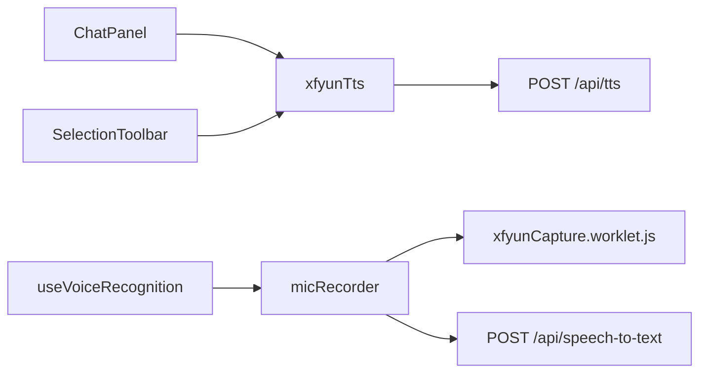

# `src/utils/` — 语音与 TTS 工具模块说明

包含三个文件：`xfyunTts.js`、`micRecorderXfyun.js`、`xfyunCapture.worklet.js`。

---

## 1. `xfyunTts.js`

**职责**：调用后端 `POST /api/tts`，把返回的二进制音频变成 `Blob` + `ObjectURL`，用 `new Audio()` 播放；管理 `ref` 生命周期避免泄漏。

| 符号 | 说明 |
|------|------|
| `TTS_API` | `apiUrl('/api/tts')`。 |
| `VOICE_PREF_KEY` | `localStorage` 音色键。 |
| `TTS_VOICE_KEYS` | 允许的枚举：`female`、`female_jiuxu`。 |
| `cleanupTtsAudio` | `pause`、清空 `src`、`revokeObjectURL`、清空 ref。 |
| `getTtsVoiceFromStorage` | 读音色；历史 `male` 迁移为 `female`。 |
| `playXfyunTts(text, ttsAudioRef, ttsObjectUrlRef, options)` | `fetch` JSON body；非 2xx 或 JSON 响应抛错；`arrayBuffer` → `Blob`；缺省 MIME 时用 `audio/wav`；`audio.play()` Promise；`onended`/`onerror` 清理 URL。 |

**与后端契约**：请求体 `{ text, voice, speed?, volume? }`；成功为 `audio/*` 流。

---

## 2. `micRecorderXfyun.js`

**职责**：`getUserMedia` → **AudioWorklet**（优先）或 ScriptProcessor 回退 → 重采样到 16k → 拼 **WAV Blob** → `POST /api/speech-to-text`（`FormData` 字段 `audio`）。

| 符号 | 说明 |
|------|------|
| `captureWorkletUrl` | `import ... '?url'` 供 `audioWorklet.addModule`。 |
| `API_PREFIX` | 由 `API_BASE` 去尾斜杠，拼绝对上传 URL。 |
| `downsampleBuffer` | 线性抽取降采样。 |
| `floatToWavBlob`（内部） | 写 RIFF/WAVE 头 + 16bit PCM 小端样本。 |
| `recordAndTranscribeXfyun(opts)` | 主入口：`signal`、`silenceMs`、`maxMs`、`noVoiceCutMs`；静音累计结束录音；`fetch` multipart；返回识别字符串。 |

**注意**：Worklet 与主线程通过 `port.onmessage` 收 Float32 块（详见源码中部）。

---

## 3. `xfyunCapture.worklet.js`

**职责**：运行在 **音频渲染线程** 的 `AudioWorkletProcessor`。

| 行号 | 含义 |
|------|------|
| 1–3 | 注释：替代 ScriptProcessor。 |
| 4 | 声明 `XfyunCaptureProcessor` 继承 `AudioWorkletProcessor`。 |
| 5–13 | `process(inputs)`：取第一输入第一声道，复制到新的 `Float32Array`，`postMessage` 到主线程（转移 `ArrayBuffer` 所有权），返回 `true` 保持处理器存活。 |
| 16 | `registerProcessor('xfyun-capture', XfyunCaptureProcessor)`：处理器名与 `micRecorderXfyun` 中 `AudioWorkletNode(ctx, 'xfyun-capture', ...)` 一致。 |

---

## 依赖关系简图

